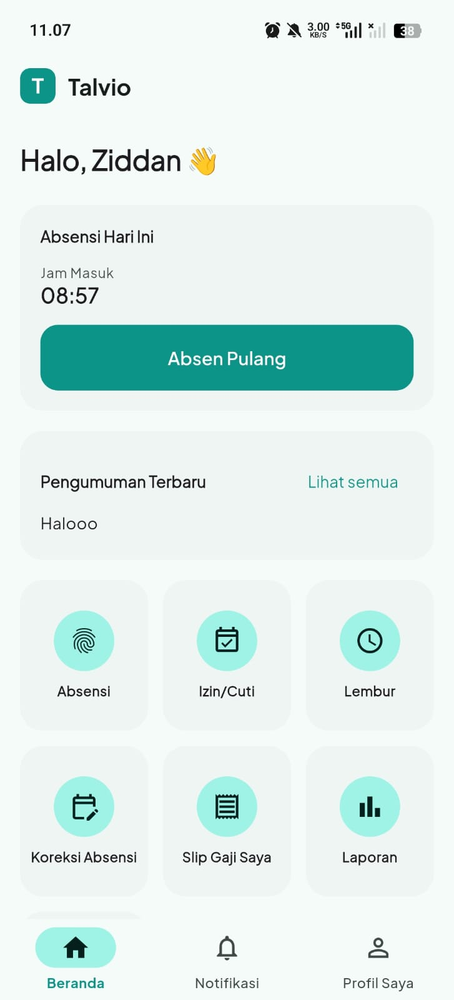
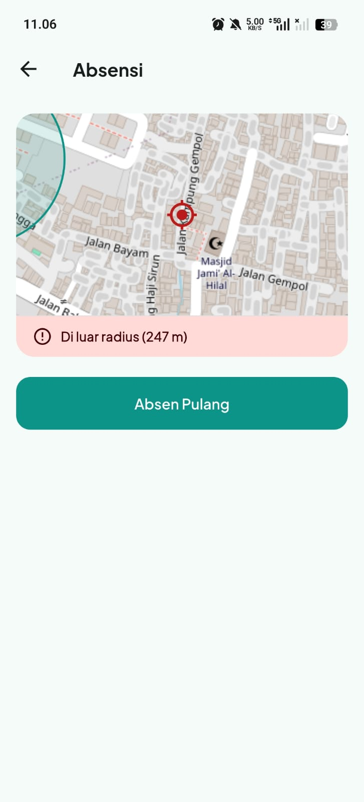
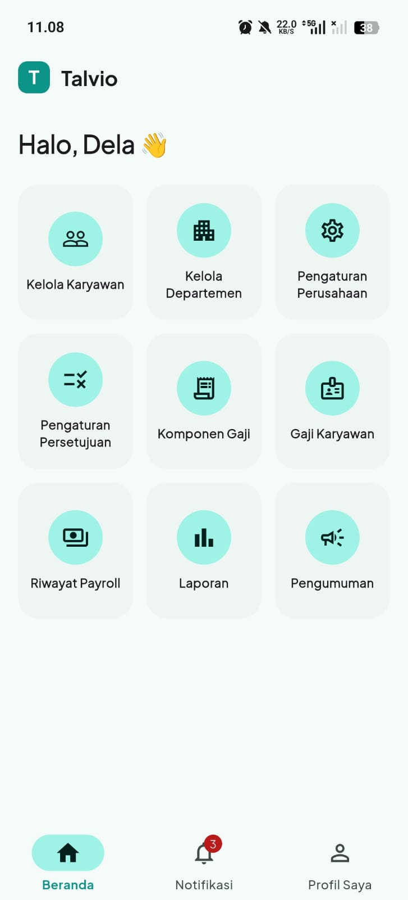
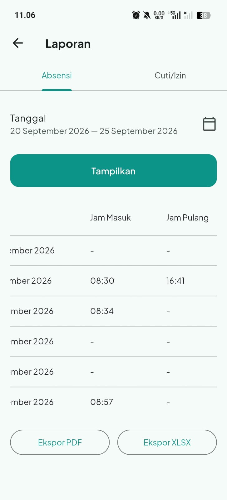
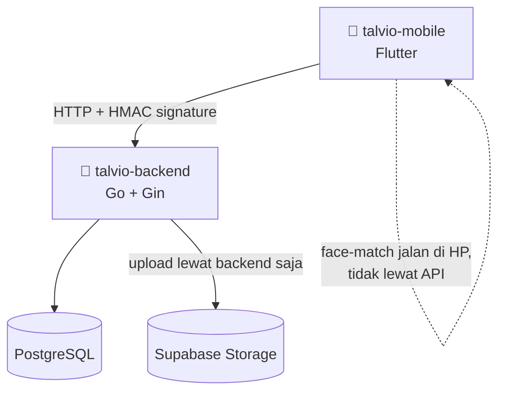
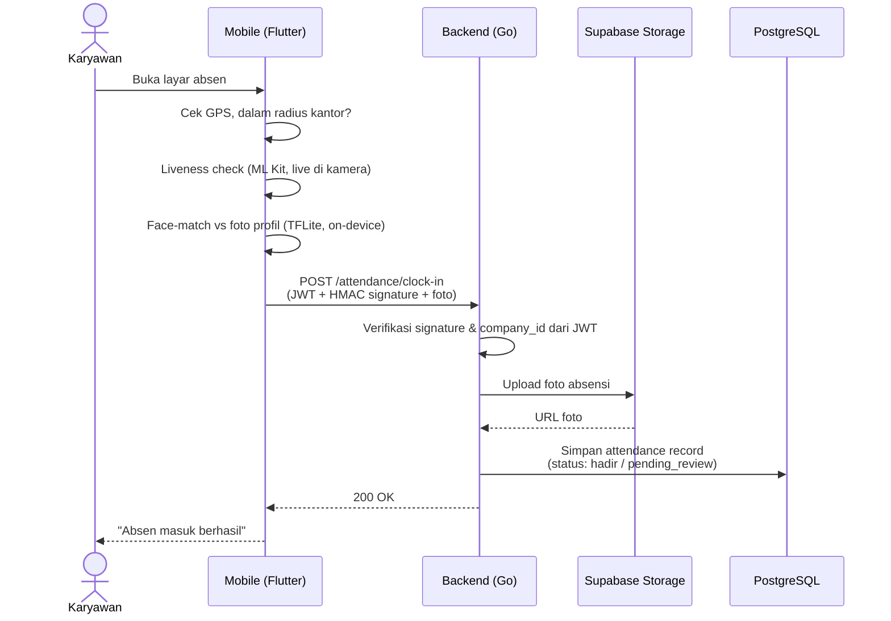
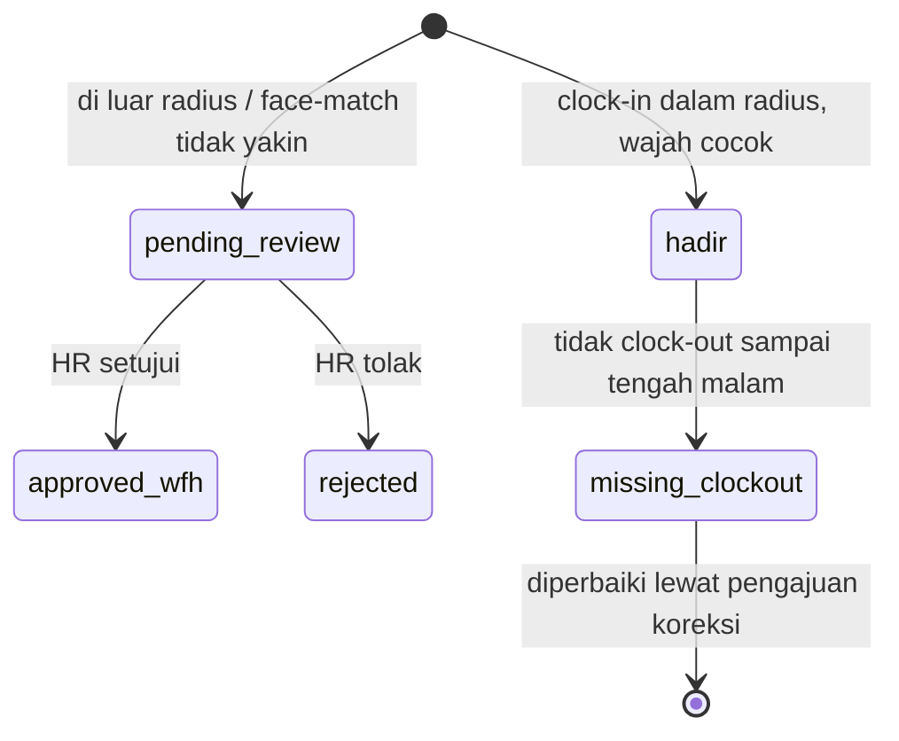

<div align="center">


<a href="https://github.com/zinedine1210/talvio-mobile">
  
</a>


[](https://github.com/zinedine1210/talvio-mobile/actions/workflows/ci.yml)

</div>

> [!NOTE]
> Repo ini adalah aplikasi mobile-nya. Backend REST API (Go + Gin + PostgreSQL) ada di repo terpisah, `talvio-backend`. Badge CI di atas jalanin `flutter analyze` + `flutter test` beneran lewat GitHub Actions tiap push, bukan gambar statis.

---

<div align="center">

| 📱 File Dart | 🧩 Layar | 🧪 Test | 🔌 Endpoint API | 🗂️ Modul Backend |
|:---:|:---:|:---:|:---:|:---:|
| **69** | **32** | **36 passing** | **62** | **11** |

</div>

## Daftar Isi

- [Kenapa Talvio](#kenapa-talvio)
- [Fitur per Modul](#fitur-per-modul)
- [Tampilan Aplikasi](#tampilan-aplikasi)
- [Arsitektur](#arsitektur)
- [Role & Akses](#role--akses)
- [Keamanan](#keamanan)
- [Tech Stack](#tech-stack)
- [Referensi API](#referensi-api)
- [Struktur Proyek](#struktur-proyek)
- [Menjalankan Secara Lokal](#menjalankan-secara-lokal)
- [Progress](#progress)
- [Tim Pengembang](#tim-pengembang)

## Kenapa Talvio

Sebagian besar aplikasi presensi kantor cuma verifikasi lokasi, gampang dikelabui foto orang lain atau titip absen. Talvio menutup dua celah itu sekaligus: **geofencing** (harus dalam radius kantor) **+ face liveness dan face-matching yang jalan langsung di HP**, jadi tidak ada foto wajah karyawan yang keluar ke server pihak ketiga, sekaligus tetap murah dijalankan karena tidak butuh API cloud berbayar per verifikasi.

Semua alur lain (izin, lembur, koreksi, payroll) mengikuti satu aturan yang sama: siapa yang berhak menyetujui apa diatur lewat konfigurasi per perusahaan (`approval_configs`), bukan di-hardcode di kode, kecuali koreksi absensi, yang sengaja selalu ke HR.

## Fitur per Modul

| Modul | Yang bisa dilakukan |
|---|---|
| 📍 **Absensi** | Clock-in/out dengan cek radius lokasi, liveness check, dan face-matching on-device terhadap foto profil |
| 🌴 **Izin & Cuti** | Ajukan cuti/izin/sakit, kuota tahunan terpotong otomatis, approval lewat resolver |
| ⏰ **Lembur** | Diklaim setelah clock-out, divalidasi terhadap jam pulang aktual, tidak bisa asal klaim |
| 📝 **Koreksi Absensi** | Revisi jam masuk/pulang yang keliru, selalu lewat approval HR |
| 💰 **Payroll** | Komponen gaji custom per karyawan, generate slip otomatis per periode cutoff |
| 📊 **Laporan** | Ringkasan absensi & cuti (personal / company-wide), export PDF & XLSX |
| 📢 **Pengumuman** | Broadcast ke seluruh perusahaan atau satu departemen |
| 🔔 **Notifikasi** | Item yang butuh approval tampil sebagai badge, bukan menu yang numpuk di beranda |

## Design Sementara Aplikasi Talvio

<div align="center">

| Home Karyawan | Absensi | Home HR | Laporan Absensi |
|:---:|:---:|:---:|:---:|
|  |  |  |  |

</div>

## Arsitektur



### Alur Clock-In (detail interaksi)



### Siklus Status Absensi

Status absensi mengikuti siklus berikut, sekali `hadir`/`rejected` tidak bisa berubah sendiri, hanya lewat review manual:



> [!IMPORTANT]
> Karyawan tidak pernah benar-benar terkunci dari absen. Kalau face-match gagal berkali-kali, sistem tetap menerima submit dan menandainya `pending_review` untuk ditinjau HR manual lewat foto yang tersimpan, tidak ada skenario karyawan asli gagal absen total karena sistem.

## Role & Akses

| | Employee | HR Admin |
|---|:---:|:---:|
| Absen, ajukan izin/lembur/koreksi | ✅ | ❌ (pakai akun karyawan terpisah bila perlu) |
| Lihat slip gaji & pengumuman sendiri | ✅ | - |
| Jadi approver (kalau ditunjuk supervisor/delegate) | ✅ | ✅ |
| Kelola karyawan, departemen, approval routing | ❌ | ✅ |
| Kelola komponen gaji & jalankan payroll | ❌ | ✅ |
| Tinjau koreksi absensi | ❌ | ✅ (satu-satunya, tidak bisa didelegasikan) |

## Keamanan

- Setiap request ke backend (kecuali `/health`) ditandatangani HMAC-SHA256, ditolak kalau timestamp meleset > 5 menit
- `company_id` selalu diambil dari klaim JWT lewat middleware, tidak pernah dipercaya dari input client
- Face-matching 100% on-device (TFLite/MobileFaceNet), foto wajah tidak pernah dikirim ke pihak ketiga
- Rate limiting per-IP di endpoint register & login
- `JWT_SECRET` dan `API_SIGNING_SECRET` wajib diisi, backend menolak menyala kalau kosong

## Tech Stack

| Layer | Pilihan |
|---|---|
| Mobile | Flutter, Riverpod, GoRouter, Dio |
| Face verification | `google_mlkit_face_detection` (liveness) + `tflite_flutter` (MobileFaceNet, on-device matching) |
| Backend | Go, Gin, GORM, PostgreSQL, JWT |
| Storage foto | Supabase Storage, diakses lewat backend saja |

## Referensi API

<details>
<summary><b>62 endpoint, dikelompokkan per modul (klik untuk buka)</b></summary>
<br/>

| Modul | Endpoint |
|---|---|
| Auth / Company | `POST /auth/register-company`, `POST /auth/login`, `POST /auth/refresh`, `GET /company/me`, `PUT /company/settings`, `GET/POST/PUT/DELETE /company/locations` |
| Onboarding | `POST /company/onboarding` |
| Employees | `GET/POST /employees`, `GET/PUT/DELETE /employees/:id`, `GET /employees/me`, `POST /employees/:id/photo`, `GET/POST/PUT/DELETE /departments` |
| Attendance | `POST /attendance/clock-in`, `POST /attendance/clock-out`, `GET /attendance/me`, `GET /attendance`, `GET /attendance/pending-review`, `POST /attendance/:id/review` |
| Correction | `POST /attendance/:id/corrections`, `GET /corrections`, `POST /corrections/:id/approve\|reject` |
| Leave | `POST /leave-requests`, `GET /leave-requests/me`, `GET /leave-requests`, `POST /leave-requests/:id/approve\|reject`, `GET /leave-quotas/me` |
| Overtime | `POST /overtime-requests`, `GET /overtime-requests/me`, `GET /overtime-requests`, `POST /overtime-requests/:id/approve\|reject` |
| Approval Config | `GET/PUT /company/approval-configs` |
| Payroll | `GET/POST /payroll/salary-components`, `PUT /employees/:id/salary`, `POST/GET/DELETE /employees/:id/salary-components`, `POST /payroll/runs`, `GET /payroll/runs`, `GET /payroll/runs/:id/details`, `GET /payroll/slips/me`, `GET /payroll/slips/:employeeId` |
| Reports | `GET /reports/attendance-summary`, `GET /reports/leave-summary` |
| Announcement | `POST/GET /announcements` |
| Dashboard | `GET /dashboard/summary` |

</details>

## Struktur Proyek

```
lib/
  core/          # api client, router, tema, formatter, signing
  features/
    auth/ onboarding/ employee/ attendance/
    leave/ overtime/ correction/ approval/
    payroll/ report/ announcement/ dashboard/
  l10n/          # ID + EN
```
Tiap feature: `data/` (model + panggilan API), `presentation/` (layar + widget), `providers/` (Riverpod).

## Menjalankan Secara Lokal

```bash
# backend dulu, lihat README talvio-backend untuk .env
cd talvio-backend && go run ./cmd/api

# lalu mobile
cd talvio-mobile
flutter pub get
flutter run --dart-define=API_BASE_URL=http://<ip-backend>:8081
```

> [!TIP]
> HP fisik lewat USB: `adb reverse tcp:8081 tcp:8081`, lalu pakai `API_BASE_URL=http://localhost:8081`. Emulator Android otomatis pakai `10.0.2.2` sebagai alias localhost, tidak perlu setting tambahan.

## Progress

| Fase | Cakupan | Status |
|---|---|:---:|
| 0 | Registrasi perusahaan + onboarding | ✅ |
| 1 | Manajemen karyawan & departemen | - |
| 2 | Absensi + geofencing + face liveness/matching | - |
| 3 | Izin/cuti + approval routing | - |
| 4 | Koreksi absensi + lembur | - |
| 5 | Laporan absensi & cuti | - |
| 6 | Payroll | - |
| 7 | Pengumuman, dashboard, notifikasi in-app | - |

Detail lengkap tiap kebutuhan fungsional/non-fungsional: lihat [`SRS.md`](./SRS.md).

## Tim Pengembang

| NPM | Nama | Modul |
|:---:|:---:|---|
| `202343501560` | `Zinedine Ziddan Fahdlevy` | `Absensi (Laporan, Approval), Dashboard, Pengumuman` |
| `202343501557` | `Dela Ramadani` | `Izin/Cuti/Lembur, Laporan, Approval` |
| `202343501558` | `Haura Nahdah` | `Management Karyawan, Departemen` |

`Rekayasa Perangkat Lunak`, `Universitas Indraprasta PGRI`

---

<p align="center"><sub>Talvio, HRIS multi-tenant, dibangun bertahap Fase 0 s/d 7.</sub></p>
