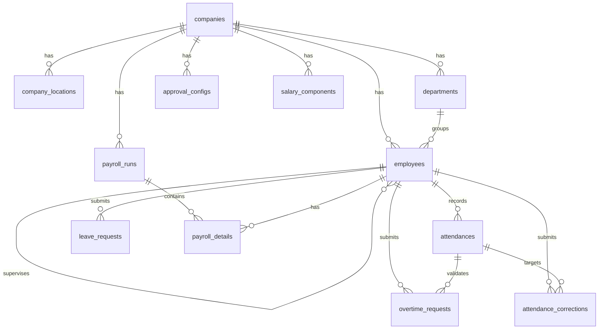

# Dokumen Software Requirements Specification (SRS)

# Project: Talvio (Multi-Tenant HRIS System)

**Revision History**

| Name | Date | Reason For Changes | Version |
| --- | --- | --- | --- |
| Tim Talvio | 2026-09-20 | Initial draft — Fase 0 (register company & onboarding) | 1.0 |
| Tim Talvio | 2026-09-22 | Update — Fase 1-7 selesai diimplementasikan (employee, attendance, leave, overtime, correction, report, payroll, announcement, dashboard) | 1.1 |

**Table of Contents**

- Introduction
- Overall Description
- External Interface Requirements
- System Features
- Other Nonfunctional Requirements
- Other Requirements
- Appendix A: Glossary
- Appendix B: Analysis Models
- Appendix C: To Be Determined List

# 1. Introduction

## 1.1 Purpose

Dokumen ini menjelaskan kebutuhan perangkat lunak Talvio, sebuah sistem HRIS (Human Resource Information System) multi-tenant untuk kantor umum. Sistem mencakup absensi berbasis GPS dan face liveness, izin/cuti, lembur, koreksi absensi, payroll otomatis, dan approval routing yang dapat dikonfigurasi per perusahaan. Dokumen ini menjadi acuan bagi pengembang, penguji, dan stakeholder dalam proses implementasi.

## 1.2 Document Conventions

Dokumen ini menggunakan penomoran FR (Functional Requirement) dan NFR (Non-Functional Requirement) untuk setiap kebutuhan, dikelompokkan per modul (mis. `FR-ATT` untuk modul Attendance). Setiap requirement bersifat unik, terukur, dan dapat diuji.

## 1.3 Intended Audience and Reading Suggestions

Dokumen ini ditujukan untuk:

- Developer sistem (acuan implementasi mobile dan backend)
- Tester QA (acuan pengujian alur bisnis)
- Dosen / Stakeholder (gambaran kapabilitas dan cakupan sistem)
- HR Admin (panduan operasional — manajemen karyawan, payroll, approval)
- Employee (panduan operasional — absensi, izin, lembur)

## 1.4 Product Scope

Talvio adalah aplikasi mobile (Flutter) dengan REST API backend (Go) untuk manajemen SDM berbasis SaaS multi-tenant — setiap perusahaan mendaftar dan mendapat workspace yang terisolasi dari perusahaan lain. Cakupan sistem:

- Registrasi perusahaan dan onboarding (lokasi kantor, jam kerja, kuota cuti, cutoff payroll)
- Manajemen karyawan dan departemen
- Absensi dengan validasi lokasi (geofencing) dan verifikasi wajah (liveness + face-matching on-device)
- Pengajuan izin/cuti/sakit dan lembur dengan approval routing fleksibel
- Koreksi absensi
- Payroll otomatis berdasarkan periode cutoff
- Laporan absensi dan cuti (personal maupun company-wide), dengan export PDF/XLSX
- Pengumuman internal perusahaan
- Dashboard ringkasan dan notifikasi in-app untuk item yang perlu di-approve

## 1.5 References

- IEEE 29148 — Systems and Software Engineering Requirements
- Sommerville, *Software Engineering*
- Pressman, *Software Engineering: A Practitioner's Approach*
- Template SRS Karl Wiegers
- Flutter Documentation — https://docs.flutter.dev/
- Gin Web Framework Documentation — https://gin-gonic.com/
- google_mlkit_face_detection — https://pub.dev/packages/google_mlkit_face_detection

# 2. Overall Description

## 2.1 Product Perspective

Talvio terdiri dari dua komponen yang dikembangkan sebagai repo terpisah:

- **Mobile app** (`talvio-mobile`, Flutter) — satu codebase, UI berbasis role (`employee` / `hr_admin`)
- **Backend API** (`talvio-backend`, Go + Gin + GORM) — REST API tersambung ke PostgreSQL, plus Supabase Storage untuk penyimpanan foto (selalu lewat backend, mobile tidak pernah pegang credential Supabase secara langsung)

## 2.2 Product Functions

- Registrasi perusahaan dan onboarding wizard
- Pengelolaan profil karyawan dan departemen
- Absensi (clock-in/clock-out) dengan validasi radius lokasi dan verifikasi wajah
- Pengajuan dan approval izin/cuti/sakit, lembur, dan koreksi absensi
- Konfigurasi approval routing per jenis pengajuan per perusahaan
- Payroll otomatis: komponen gaji, generate slip per periode cutoff
- Laporan absensi/cuti dengan export
- Pengumuman internal
- Dashboard ringkasan dan notifikasi in-app

## 2.3 User Classes and Characteristics

- **Employee**: karyawan yang absen, mengajukan izin/lembur/koreksi, melihat slip gaji dan pengumuman. Bisa juga bertindak sebagai approver jika ditunjuk sebagai supervisor atau delegate.
- **HR Admin**: pengguna internal yang bertanggung jawab mengelola karyawan/departemen, mengatur approval routing, mengelola payroll, dan meninjau koreksi absensi (approval koreksi selalu HR, tidak lewat routing biasa).

## 2.4 Operating Environment

- **Mobile**: Android (minimum sesuai `minSdkVersion` proyek) dan iOS
- **Backend**: Go runtime, di-deploy sebagai REST API
- **Database**: PostgreSQL
- **Storage**: Supabase Storage (foto profil dan foto absensi)

## 2.5 Design and Implementation Constraints

- Dual Repo Project (Mobile + Backend), masing-masing punya riwayat git sendiri
- Bahasa pemrograman: Dart (mobile), Go (backend)
- Karyawan merangkap akun login — tidak ada tabel `users` terpisah, karena setiap login pasti seorang karyawan (termasuk HR)
- Asumsi MVP: seluruh perusahaan berada di zona waktu WIB (Asia/Jakarta, UTC+7) — upgrade path (tambah kolom `timezone` per company) belum diimplementasikan
- Autentikasi JWT (access + refresh token) dengan claim `user_id`, `company_id`, `role`

## 2.6 User Documentation

- `README.md` — ringkasan proyek, fitur, tech stack, cara menjalankan
- `SRS.md` (dokumen ini) — kebutuhan perangkat lunak lengkap

## 2.7 Assumptions and Dependencies

- Pengguna memiliki akses internet untuk terhubung ke backend dan cloud storage
- Fase MVP tidak mencakup deteksi fake-GPS (mock location) — sistem percaya lokasi GPS device apa adanya
- Notifikasi push (Firebase Cloud Messaging) belum diimplementasikan pada fase ini — item yang perlu di-approve ditampilkan sebagai notifikasi in-app (badge + daftar), bukan push notification ke tray HP

# 3. External Interface Requirements

## 3.1 User Interfaces

- Register Company & Login
- Onboarding Wizard (lokasi, jam kerja, kuota cuti, cutoff payroll, approval default)
- Home / Dashboard (berbeda untuk Employee dan HR Admin)
- Absensi (kamera + peta lokasi live)
- Izin/Cuti, Lembur, Koreksi Absensi (form pengajuan + daftar approval)
- Notifikasi (daftar item yang perlu di-approve)
- Payroll (komponen gaji, gaji karyawan, payroll run, slip gaji)
- Laporan
- Pengumuman
- Manajemen Karyawan & Departemen (HR)
- Pengaturan Approval Routing (HR)
- Profil Saya

## 3.2 Hardware Interfaces

- Kamera perangkat (capture foto absensi dan face liveness/matching)
- GPS/location sensor perangkat (validasi radius lokasi kantor)

## 3.3 Software Interfaces

- REST API (Dio HTTP client) untuk komunikasi mobile ↔ backend
- Supabase Storage REST API (diakses backend, bukan mobile langsung)
- `google_mlkit_face_detection` untuk deteksi wajah/liveness
- `tflite_flutter` (model MobileFaceNet) untuk face-matching on-device

## 3.4 Communications Interfaces

- HTTP/HTTPS dengan setiap request (kecuali `/health`) ditandatangani HMAC-SHA256 (`X-Timestamp` + `X-Signature`)
- Upload foto (absensi, profil) via `multipart/form-data`

# 4. System Features

## 4.1 Auth & Company

- **FR-AUTH-01**: Sistem dapat mendaftarkan perusahaan baru beserta akun HR Admin pertama
- **FR-AUTH-02**: Sistem menyediakan login dengan email + password, mengembalikan access token dan refresh token
- **FR-AUTH-03**: Sistem dapat memperbarui access token menggunakan refresh token
- **FR-AUTH-04**: HR Admin dapat melengkapi onboarding wizard (lokasi kantor, jam kerja, kuota cuti default, cutoff payroll, konfigurasi approval default) setelah registrasi

## 4.2 Employee & Department Management

- **FR-EMP-01**: HR Admin dapat menambah, mengubah, dan melihat detail data karyawan
- **FR-EMP-02**: Penghapusan karyawan bersifat soft-deactivate (`status: inactive`), bukan hard delete
- **FR-EMP-03**: HR Admin dapat mengelola data departemen dan menetapkan supervisor per karyawan
- **FR-EMP-04**: Karyawan/HR dapat mengunggah foto profil (dipakai juga sebagai foto acuan face-matching)
- **FR-EMP-05**: HR Admin dapat menetapkan lokasi kerja (`company_location`) per karyawan untuk validasi geofencing

## 4.3 Attendance

- **FR-ATT-01**: Karyawan dapat clock-in dan clock-out disertai foto, koordinat GPS, dan hasil face-matching
- **FR-ATT-02**: Sistem memvalidasi radius lokasi terhadap lokasi kerja yang ditetapkan untuk karyawan tersebut; di luar radius wajib menyertakan catatan dan berstatus `pending_review`
- **FR-ATT-03**: Sistem menjalankan liveness check (deteksi wajah nyata) sebelum foto diambil
- **FR-ATT-04**: Sistem menghitung face-matching (live capture vs foto profil) on-device dan menyimpan skor + status (`match`/`uncertain`/`mismatch`) pada record absensi
- **FR-ATT-05**: Karyawan tidak pernah terkunci total dari absen — kegagalan face-match berulang tetap mengizinkan submit dan menandai untuk ditinjau HR
- **FR-ATT-06**: Sistem menghitung status terlambat (`is_late`) otomatis berdasarkan `work_start_time` + toleransi
- **FR-ATT-07**: Absensi yang belum clock-out di akhir hari kalender WIB otomatis ditutup sistem berstatus "lupa clock-out"
- **FR-ATT-08**: HR (atau approver hasil resolusi) dapat meninjau dan mengubah status absensi yang masuk radar review

## 4.4 Leave / Cuti-Izin-Sakit

- **FR-LEAVE-01**: Karyawan dapat mengajukan izin/cuti/sakit dengan rentang tanggal dan alasan
- **FR-LEAVE-02**: Sistem menghitung dan memotong kuota tahunan otomatis untuk tipe `cuti`
- **FR-LEAVE-03**: Pengajuan dirutekan ke approver hasil resolusi approval routing (supervisor/delegate/HR)
- **FR-LEAVE-04**: Approver dapat menyetujui atau menolak pengajuan

## 4.5 Overtime

- **FR-OT-01**: Karyawan dapat mengajukan klaim lembur setelah clock-out (bukan rencana di muka)
- **FR-OT-02**: Sistem menolak klaim yang rentang waktunya belum didukung oleh `clock_out_at` aktual, dengan pesan untuk mengajukan koreksi absensi dulu
- **FR-OT-03**: Klaim lembur yang melewati tengah malam wajib diajukan sebagai dua pengajuan terpisah (satu per tanggal kalender)
- **FR-OT-04**: Pengajuan dirutekan ke approver hasil resolusi approval routing

## 4.6 Attendance Correction

- **FR-CORR-01**: Karyawan dapat mengajukan koreksi jam masuk atau jam pulang pada record absensi tertentu
- **FR-CORR-02**: Approval koreksi absensi selalu ditujukan ke HR, tidak pernah lewat approval routing biasa

## 4.7 Approval Configuration

- **FR-APPR-01**: HR Admin dapat mengatur mode approval (`supervisor` / `delegate` / `hr`) per jenis pengajuan (`leave`, `overtime`, `wfh_review`) untuk perusahaannya
- **FR-APPR-02**: Sistem meresolusi approver saat pengajuan dibuat sesuai mode yang dikonfigurasi, dengan fallback ke HR bila `supervisor_id` kosong

## 4.8 Payroll

- **FR-PAY-01**: HR Admin dapat mengelola komponen gaji (tunjangan/potongan, nominal tetap atau persentase)
- **FR-PAY-02**: HR Admin dapat menetapkan gaji pokok dan komponen gaji per karyawan
- **FR-PAY-03**: Sistem dapat men-generate payroll run untuk satu periode cutoff, menghitung gaji bersih dari gaji pokok, potongan cuti tanpa bayar, lembur disetujui, tunjangan, dan potongan tetap
- **FR-PAY-04**: Karyawan dapat melihat slip gaji miliknya sendiri; HR dapat melihat slip gaji seluruh karyawan

## 4.9 Report

- **FR-REP-01**: Sistem menyediakan ringkasan laporan absensi dan cuti, personal (employee) maupun company-wide (HR)
- **FR-REP-02**: Laporan dapat diekspor dalam format PDF atau XLSX

## 4.10 Announcement

- **FR-ANN-01**: HR Admin dapat membuat pengumuman yang ditargetkan ke seluruh perusahaan atau satu departemen tertentu
- **FR-ANN-02**: Karyawan dapat melihat pengumuman yang relevan dengan dirinya (all-targeted + departemennya sendiri)

## 4.11 Dashboard & Notification

- **FR-DASH-01**: Sistem menampilkan ringkasan dashboard: status absensi hari ini, jumlah item pending yang perlu di-approve, dan pengumuman terbaru
- **FR-DASH-02**: Item yang memerlukan approval (izin, lembur, WFH-review, koreksi) ditampilkan sebagai notifikasi in-app (ikon lonceng + badge jumlah), dikelompokkan per jenis, bukan sebagai menu permanen di halaman utama

# 5. Other Nonfunctional Requirements

## 5.1 Performance Requirements

- **NFR-PERF-01**: Validasi lokasi (GPS) dilakukan lebih dulu, sebelum membuka kamera — lokasi murah/cepat dicek, verifikasi wajah baru dijalankan setelah lokasi diperoleh
- **NFR-PERF-02**: Deteksi wajah pada preview kamera dijalankan dengan interval throttle (bukan per-frame penuh) agar tidak membanjiri antrian pemrosesan di perangkat

## 5.2 Safety Requirements

- Karyawan yang dihapus tidak benar-benar dihapus dari basis data — hanya dinonaktifkan (`status: inactive`), riwayat absensi/payroll tetap utuh
- Karyawan tidak pernah gagal absen total karena sistem: kegagalan face-match tetap mengizinkan submit untuk ditinjau manual oleh HR

## 5.3 Security Requirements

- **NFR-SEC-01**: Setiap request backend (kecuali `/health`) wajib menyertakan HMAC-SHA256 signature (`X-Timestamp` + `X-Signature`) dengan window validitas 5 menit
- **NFR-SEC-02**: Tenant scoping (`company_id`) selalu diinjeksikan dari klaim JWT lewat middleware — tidak pernah dipercaya dari body/param yang dikirim client
- **NFR-SEC-03**: Face-matching diproses 100% on-device (TFLite) — foto wajah tidak pernah dikirim ke API pihak ketiga
- **NFR-SEC-04**: Rate limiting per-IP pada endpoint registrasi perusahaan dan login untuk meredam spam/brute force
- **NFR-SEC-05**: `JWT_SECRET` dan `API_SIGNING_SECRET` wajib diset — backend gagal boot (fail-fast) apabila kosong, tidak ada fallback diam-diam ke nilai default

## 5.4 Software Quality Attributes

- **Usability**: UI berbasis role — Employee dan HR Admin masing-masing hanya melihat menu yang relevan dengan tanggung jawabnya
- **Scalability**: Arsitektur multi-tenant memungkinkan penambahan perusahaan baru tanpa perubahan skema
- **Portability**: Mobile app berjalan di Android dan iOS dari satu codebase Flutter

## 5.5 Business Rules

- Satu attendance record merepresentasikan satu hari kalender WIB — tidak pernah lintas hari; percobaan clock-in kedua pada hari yang sama ditolak
- Klaim lembur yang rentang waktunya lintas tengah malam wajib dipecah menjadi dua pengajuan terpisah, masing-masing tervalidasi ke attendance hari kalendernya sendiri
- Koreksi absensi selalu disetujui HR, tidak pernah lewat approval routing biasa
- Payroll run menghitung ulang periode berdasarkan `payroll_cutoff_day` — pengajuan bertanggal setelah cutoff otomatis masuk periode berikutnya

# 6. Other Requirements

- Tidak ada kebutuhan khusus tambahan pada fase ini.

# Appendix A: Glossary

- **FR**: Functional Requirement
- **NFR**: Non-Functional Requirement
- **Tenant**: Satu perusahaan terdaftar dengan workspace terisolasi dari perusahaan lain
- **Geofencing**: Validasi apakah koordinat GPS berada dalam radius suatu titik lokasi
- **Liveness**: Deteksi bahwa wajah di depan kamera adalah wajah nyata (bukan foto/video)
- **Face-Matching**: Pencocokan embedding wajah live capture terhadap foto profil terdaftar
- **WFH Review**: Peninjauan absensi yang dilakukan di luar radius lokasi kantor
- **Cutoff**: Tanggal batas periode perhitungan payroll
- **Delegate**: Karyawan yang ditunjuk sebagai approver pengganti untuk jenis pengajuan tertentu

# Appendix B: Analysis Models

## Entity Relationship Diagram



## Alur Approval Resolver

```
approver = approval_configs.find(company_id, request_type)
switch approver.mode:
  hr         -> assign ke hr_admin company
  supervisor -> assign ke employee.supervisor_id (fallback hr kalau kosong)
  delegate   -> assign ke approver.delegate_employee_id
```

Analysis model lain (Use Case Diagram, Activity Diagram, Class Diagram) mengikuti struktur modul pada Bagian 4 di atas.

# Appendix C: To Be Determined List

- **TBD-01**: Notifikasi push (Firebase Cloud Messaging) ke tray HP — saat ini baru notifikasi in-app
- **TBD-02**: Deteksi fake-GPS (mock location) pada saat absensi
- **TBD-03**: Payroll run dengan status `draft` yang bisa direvisi sebelum `final` — endpoint transisi belum tersedia
- **TBD-04**: Delegate approval per departemen (saat ini satu delegate berlaku untuk seluruh perusahaan per jenis pengajuan)
- **TBD-05**: Dukungan multi-timezone per perusahaan (saat ini seluruh perusahaan diasumsikan WIB)
